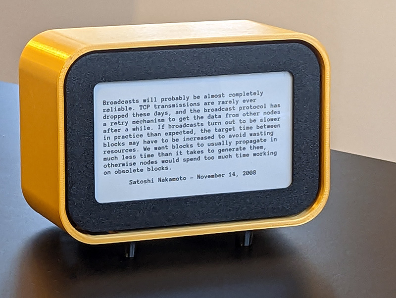
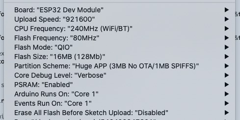
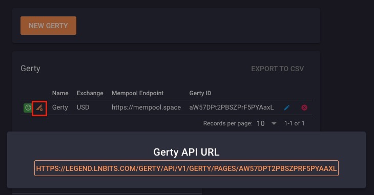

# Gerty - Your Bitcoin Assistant

Gerty, a Bitcoin Assistant controlled from your LNbits wallet.

Build your own Gerty or buy a [pre-assembled Gerty from the LNbits shop](https://shop.lnbits.com/product/gerty-a-bitcoin-assistant).

What does Gerty show?

+ Current block height
+ A list of Satoshi's quotes from bitcointalk.org
+ Your LNbits wallet balance
+ An onchain dashboard
+ A lightning dashboard
+ A mining dashboard
+ Current Bitcoin price in your prefered currency
+ Website status check
+ Mempool fees [coming soon]
+ Samourai Whirlpool dashboard [coming soon]

## Parts List

+ [LilyGo 4.7 EPD](http://www.lilygo.cn/prod_view.aspx?TypeId=50061&Id=1384&FId=t3:50061:3)
+ [Switch](https://www.amazon.co.uk/gp/product/B00OK9FAUW/)
+ A 3.7v, 1000mah or 2000mah LiPo battery
+ [3D printed case](enclosure/)
+ M2.5 3.2mm diameter heat set inserts and screws
+ [A 90 degree USB-C adapter](https://www.amazon.co.uk/Downward-Extension-Compatible-Microsoft-Nintendo/dp/B07JKBKM12/)

## Operating Instructions
+ Hold the button on the top of Gerty whilst powering on to launch the configuration access point
+ Tap the button on top of Gerty to refresh Gerty's display

## Build Instructions (Arduino)

+ Clone the Gerty repository to your computer
+ Copy libraries directory to your Arduino directory
+ Open the Gerty project in the Arduino IDE
+ Check that your Arduino > Tools settings match these values

+ Connect the LilyGo EPD to computer
+ Upload the Sketch to your board `Sketch > Upload`
+ Create an LNbits wallet and enable the Gerty extension
+ Create a new Gerty and configure your Gerty options
+ Click this button and then click the Gerty API URL to copy the text to your clipboard 
+ Connect to AP - Password "ToTheMoon1"
+ The Gerty Captive Portal page should appear in a web browser, if it doesn't open a web browser and navigate to [http://6.15.6.16/](http://6.15.6.16/)
+ Click on the "Gerty Settings" tab and paste the copied API URL into the API URL field. Click `Save`
+ Click on the "Configure new AP" tag, select an access point, enter the AP's passphrase and click `Apply`
+ If you have printed a case for Gerty, place your Gerty into the printed enclosure
+ Bask in the glory of Gerty!

## Build Instructions (Platformio and Visual Studio code)
 
+ Clone the Gerty repository to your computer
+ If platformio is not yet installed:
  + Open Visual Studio Code
  + Click the 'Extensions' icon in the left menu bar (or press Ctrl-Shift-X)
  + Type 'platformio' in the search field
  + Click on 'PlatformIO IDE' with the Alien icon. 
  + Click 'install' 
+ Open the root folder of the Gerty repository in Visual Studio code
+ Change 'qrcoded.h' to 'qrcode.h' on line 28 of gerty.ino
+ Build and upload firmware by clicking on the '->' (right arrow) button on the bottom status bar)

